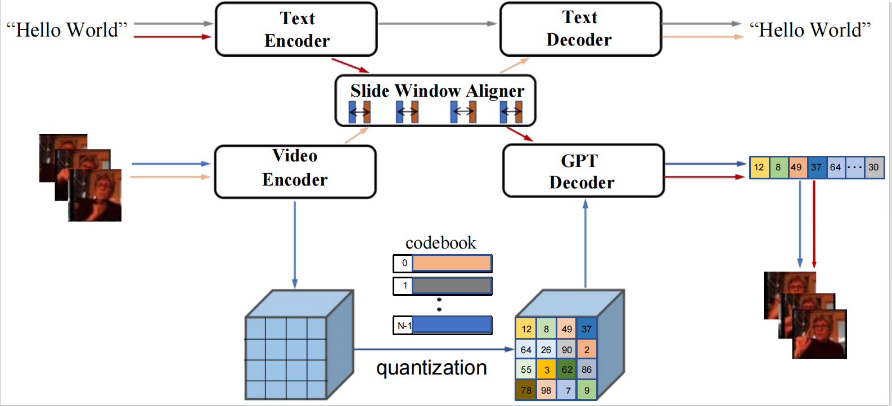
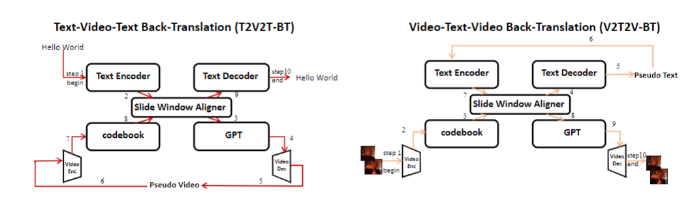
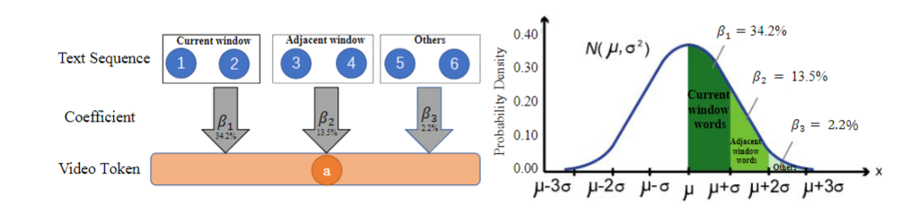

# USLNet: Unsupervised Sign Language Translation and Generation

## Table of Contents 📚

- [Architecture](#architecture)
- [Unsupervised Cross-Modality Back-Translation](#back-translation)
- [Alignment Strategy](#alignment-strategy)
- [Usage](#usage)
- [Citation](#future-work-and-contributions)


## Architecture 🔑
<div align="center">
  
</div>
Motivated by the success of unsupervised neural machine translation (UNMT), we
introduce an unsupervised sign language translation and generation network (USLNet), which learns from abundant single-modality (text and video) data without parallel sign language data. USLNet comprises two main components: single-modality reconstruction modules (text and video) that rebuild the input from its noisy version in the same modality and cross-modality back-translation modules (text-video-text and video-text-video) that reconstruct the input from its noisy version in the different modality using back-translation procedure.
Unlike the single-modality back-translation procedure in text-based UNMT, USLNet faces the cross-modality discrepancy in feature representation, in which the length and the feature dimension mismatch between text and video sequences.
We propose a sliding window method to address the issues of aligning variable-length text with video sequences.
To our knowledge, USLNet is the first unsupervised sign language translation and generation model capable of generating both natural language text and sign language video in a unified manner.

## Unsupervised Cross-Modality Back-Translation 
<div align="center">
  
</div>

## Alignment Strategy
<div align="center">
  
</div>

## Usage
1. **Downloading dataset:** 
2. **Unsupervised Video Pretrain:** 
   ```
   bash src/model/videoPretrain.sh ${your_output_dir} $training_pairs$
   ```

3. **Unsupervised Text Pretrain:** 
   ```
   bash src/model/textPretrain.sh ${your_output_dir} $training_pairs$
   ```

4. **Unsupervised Back-Translation:** 
    ```
   python3 train/train.py ${your_output_dir} $training_config_json$
   ```


## Citation

```bibtex
@article{guo2024unsupervised,
  title={Unsupervised Sign Language Translation and Generation},
  author={Guo, Zhengsheng and He, Zhiwei and Jiao, Wenxiang and Wang, Xing and Wang, Rui and Chen, Kehai and Tu, Zhaopeng and Xu, Yong and Zhang, Min},
  journal={arXiv preprint arXiv:2402.07726},
  year={2024}
}
```
